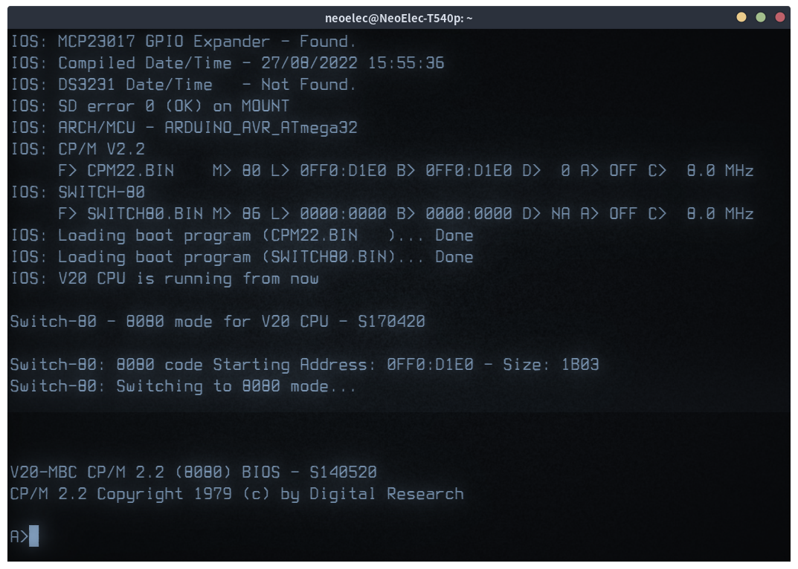
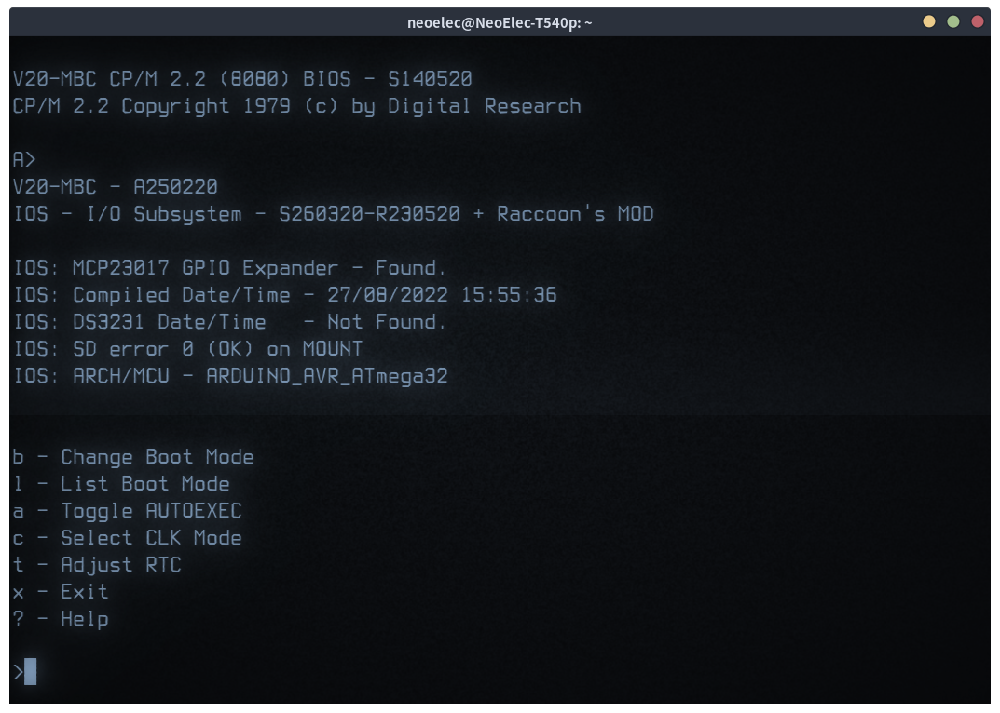
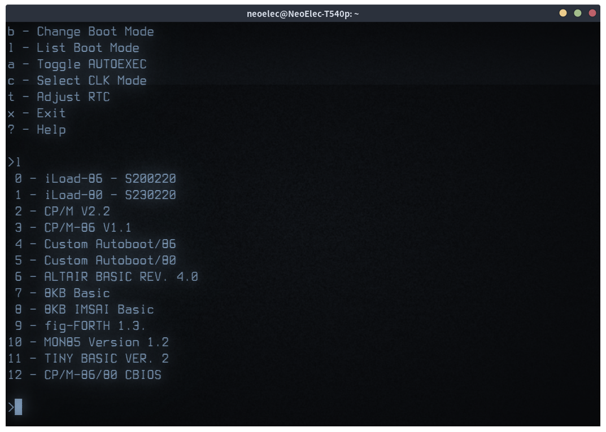
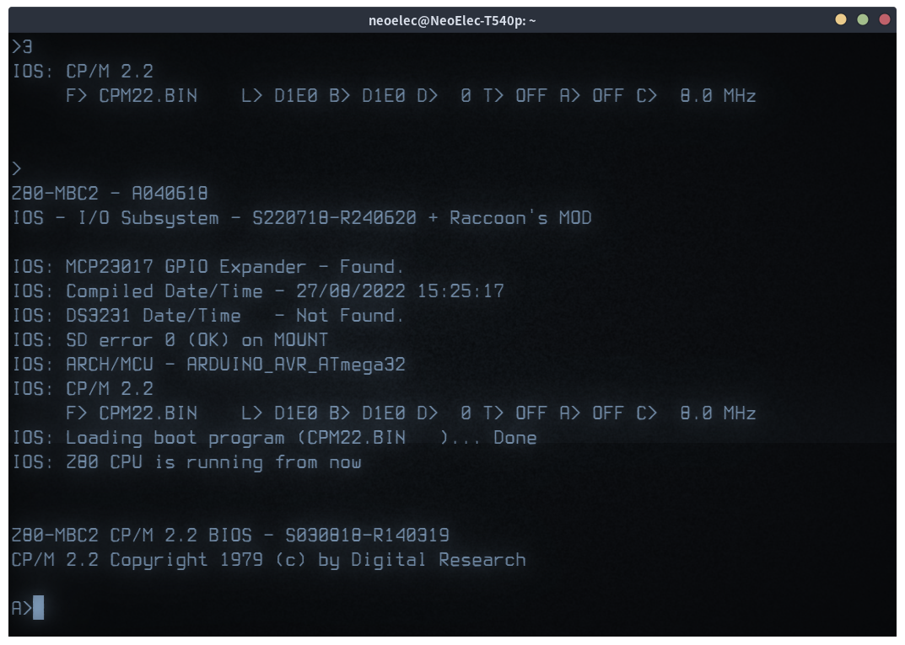
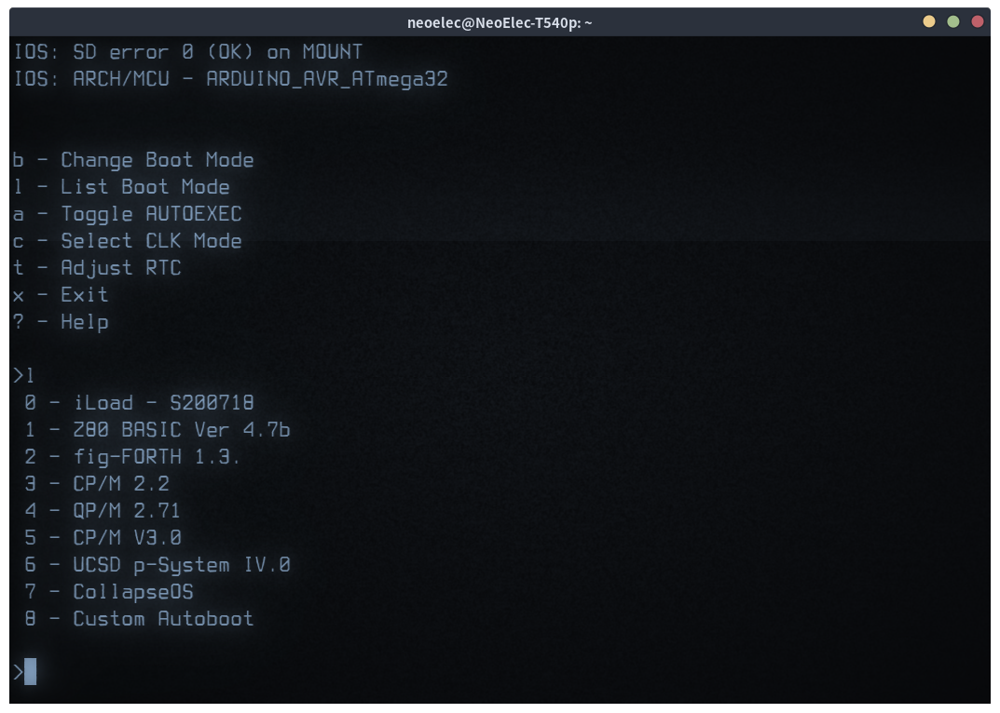

# Raccoon's Alternative IOS for Z80-MBC2 and V20-MBC

## Features
- CSV based configuration to replace Autoboot.bin and Au80boot.bin files.
  - This can make users add a new boot mode without changes ATmega firmwares
- Refactoring with OOP aproach
  - Most of source codes are shared between Z80-MBC2 and V20-MBC

## CSV Files
### Z80-MBC2
- You can find pre-devined CSV files in the 'contents/SD-S220718-R240620-v1' directory.
- You can use the original SD file - SD-S220718-R240620-v1.zip - with files in the 'contents/SD-S220718-R240620-v1' directory.
- Example - BOOTMO05.CSV
```
CP/M V3.0,CPMLDR.COM,0100,0100,2,0,0
```
|Description|Boot File|Load Addr|Boot Addr|Disk Set|IRQ Tty Rx|IRQ Sys Tick|
|-|-|-|-|-|-|-|
|CP/M V3.0|CPMLDR.COM|0100|0100|2|0|0|
- Example - BOOTMO01.CSV
```
Z80 BASIC Ver 4.7b,BASIC47.BIN,0000,0000,-1,1,0
```
|Description|Boot File|Load Addr|Boot Addr|Disk Set|IRQ Tty Rx|IRQ Sys Tick|
|-|-|-|-|-|-|-|
|Z80 BASIC Ver 4.7b|BASIC47.BIN|0000|0000|-1|1|0|

### V20-MBC2
- You can find pre-devined CSV files in the 'contents/SD-S260320-R230520-v3' directory.
- You can use the original SD file - SD-S260320-R230520-v3.zip - with files in the 'contents/SD-S260320-R230520-v3'
- Example - BOOTMO02.CSV
```
CP/M V2.2,1,CPM22.BIN,0FF0,D1E0,0FF0,D1E0,0000,0000,0
```
|Description|Mode 80|Boot File|Load Segment|Load Offset|Boot Segment|Boot Offset|ptr Boot Offset|ptr Boot Size|Diske Set|
|-|-|-|-|-|-|-|-|-|-|
|CP/M V2.2|1|CPM22.BIN|0FF0|D1E0|0FF0|D1E0|0000|0000|0|
- Example - BOOTO03.CSV
```
CP/M-86 V1.1,0,CPM86.BIN,0000,0400,0040,2500,0000,0000,1
```
|Description|Mode 80|Boot File|Load Segment|Load Offset|Boot Segment|Boot Offset|ptr Boot Offset|ptr Boot Size|Diske Set|
|-|-|-|-|-|-|-|-|-|-|
|CP/M-86 V1.1|0|CPM86.BIN|0000|0400|0040|2500|0000|0000|1|
- Special CSV file to switch 80-mode - S170420.CSV
  - ptr Boot Offset : The address storing a boot address of second stage. This **MUST** be matched with 'SWITCH80.BIN'.
  - ptr Boot Size : The address storing a size of sencond stage. This **MUST** be matched with 'SWITCH80.BIN'.
  - You can determine these variable after assembling S170420.asm file with *'--l S170420.lst'* option.
```
   169                                  strAddr:
   170 000000C1 0000                                            dw      0       ; Starting addres of the 8080 code.
   171                                                                          ; The addres must be equal to SWITCH80_STRADDR (IOS)
   172                                                                          ; NOTE: this word is updated dinamically at
   173                                                                          ; load time by the IOS with the real value
   174                                  binSize:
   175 000000C3 0000                                            dw      0       ; Size in bytes of the 8080 code.
   176                                                                          ; The addres must be equal to SWITCH80_STRADDR (IOS)
   177                                                                          ; NOTE: this word is updated dinamically at
   178                                                                          ; load time by the IOS with the real value
   179                                                                          ; A 0 value means 65536 bytes (see IOS)

```
```
SWITCH-80,0,SWITCH80.BIN,0000,0000,0000,0000,00C1,00C3,-1
```
|Description|Mode 80|Boot File|Load Segment|Load Offset|Boot Segment|Boot Offset|ptr Boot Offset|ptr Boot Size|Diske Set|
|-|-|-|-|-|-|-|-|-|-|
|SWITCH-80|0|SWITCH80.BIN|0000|0000|0000|0000|00C1|00C3|-1|
- **.BIN** files under '8080' director of 'SD-S260320-R230520-v3.zip' can also suported throuch CSV files but, the file name should be changed and copied to the root directory.

|Original|Modified|
|-|-|
|AltairBasic8k_v4.bin|ABASIC8K.BIN|
|basic8k78.bin|BASIC878.BIN|
|basic8k_IMSAI.bin|BASIC8IM.BIN|
|figforth130.bin|FORTH13.BIN|
|mon85-v12-ncb85.bin|MON85V12.BIN|
|tinybasic-2.0.bin|TINYBSIC.BIN|
- 'BOOTMO12.CSV' has same configurations as 'BOOTMO03.CSV' except a 'Boot File'. In this configuration,  **'CPM8680.BIN'** is used which can be found https://github.com/binaryspider/v20-mbc_cpm8680_cbios.

## Library Dependencies
  - [Petit FatFs:](https://github.com/Master811129/PF)
  - [Adafruit RTCLib](https://github.com/adafruit/RTClib)
  - [Adafruit MCP23017](https://github.com/adafruit/Adafruit-MCP23017-Arduino-Library)
  - [Serial Menu Command ](https://github.com/ARTS37/SerialMenuCmd)

## Screenshots








